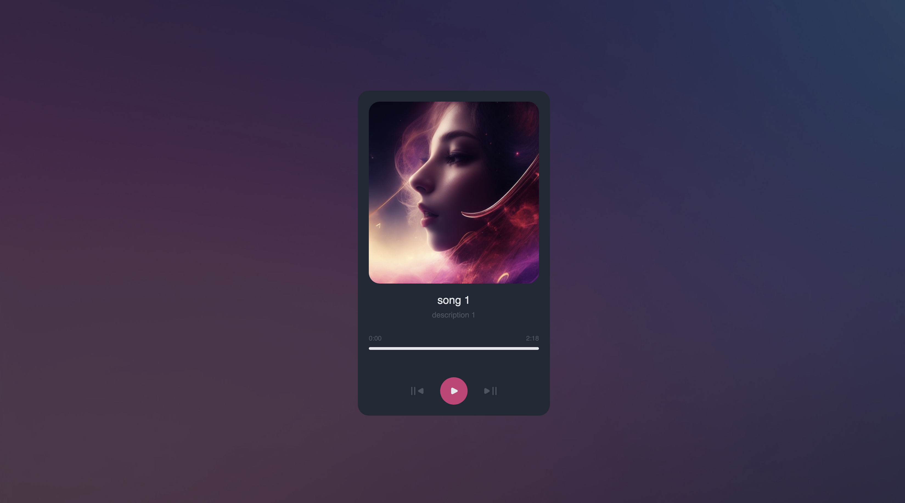

# devchallenges - Music Player Solution

This is a solution to the [Music Player solution](https://devchallenges.io/challenge/music-player). This challenge is
an excellent opportunity to enhance my JavaScript skills by creating a 
simple music player app that tests my data management capabilities using JavaScript.

## Table of contents

- [Overview](#overview)
    - [User Story](#User-Story)
    - [Screenshot](#screenshot)
    - [Links](#links)
- [My process](#my-process)
    - [Built with](#built-with)
    - [What I learned](#what-i-learned)
    - [Continued development](#continued-development)
    - [Useful resources](#useful-resources)
- [Author](#author)
- [Acknowledgments](#acknowledgments)


## Overview

### User Story

Users should be able to:

- Create a music player app that matches the given design.
- Use HTML to create the basic structure.
- Add image, title, author, progress bar, player button,... according to the design.
- Use vanilla JavaScript to add interactivity.
- Users should be able to play and stop the current song.
- Users should be able to go to next and previous songs.
- Users should be able to change play time with the progress bar.
- The page should be responsive on different screen sizes.
- Deploy the solution and submit Repository URL and Demo URL.


### Screenshot



### Links

- Solution URL: https://github.com/amjadsh97/sound-player
- Live Site URL: https://sound-player-seven.vercel.app/

## My process

### Built with

- Semantic HTML5 markup
- CSS.
- Vanilla JS.


### What I learned


```js
//Function to find the width of progress line
function handleSeek(event) {
	const rect = progressBar.getBoundingClientRect();
	const offsetX = event.clientX - rect.left;
	const width = rect.width;
	const newTime = (offsetX / width) * playerElement.duration;
	playerElement.currentTime = newTime;
}

//function to update the width of progress
function updateProgressBar() {
	const progress = (playerElement.currentTime / playerElement.duration) * 100;
	innerProgressBar.style.width = `${progress}%`;
}

```

### Continued development

In the future, I will prioritize further developing my skills in making the user experience
more seamless and intuitive by focusing on responsive design principles. I aim to delve
deeper into backend development, especially database management and user authentication,
to enhance the functionality and security of the applications I build.


### Useful resources

- [HTML Audio/Video Events](https://www.w3schools.com/tags/ref_av_dom.asp) - W3Schools is a freemium educational website for learning coding online.


## Author

- Website - [Amjad Shadid](https://amjadshadid.vercel.app/)
- Frontend Mentor - [@amjadsh97](https://www.frontendmentor.io/profile/amjadsh97)
- devchallenges - [Amjad Shadid](https://devchallenges.io/profile/421f394d-f24a-481a-90e9-c80e07f1641a)
- Twitter - [@Amjadshadid](https://twitter.com/Amjadshadid)
- Linkedin - [@Amjad Shadid](https://www.linkedin.com/in/amjad-shadid-134355134/)